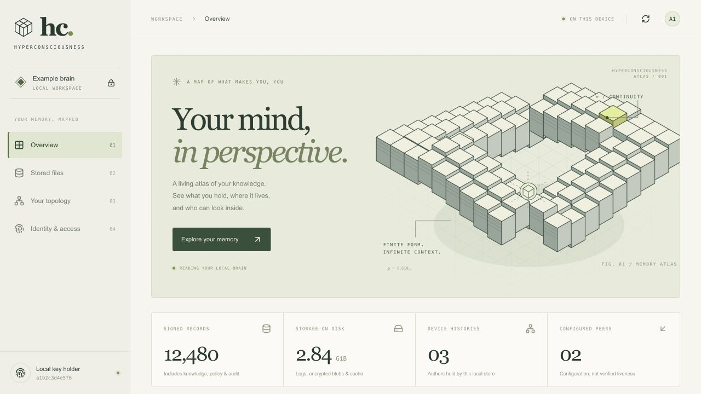
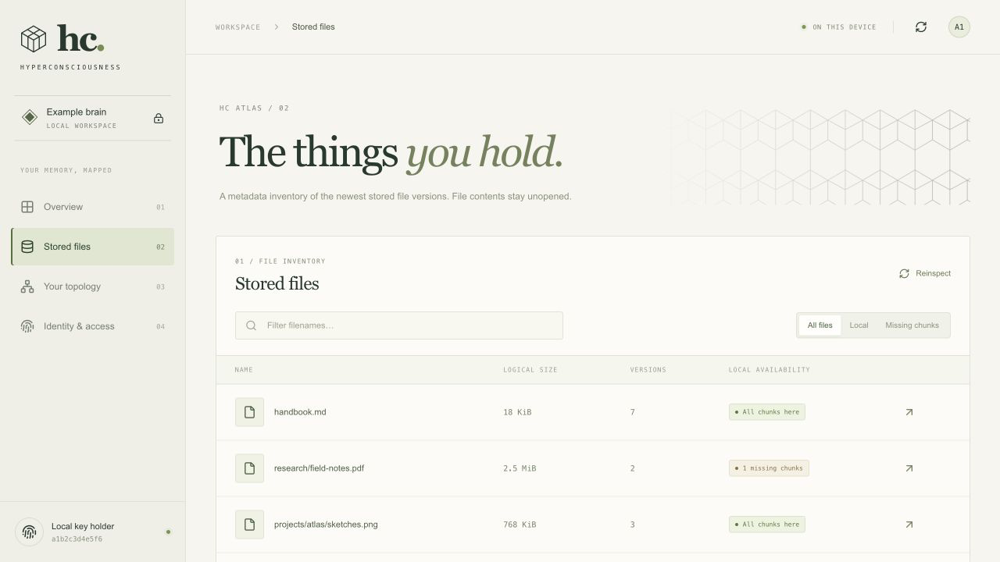
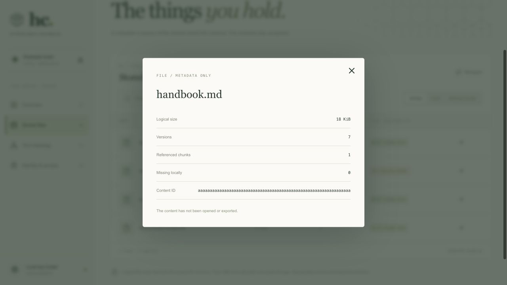
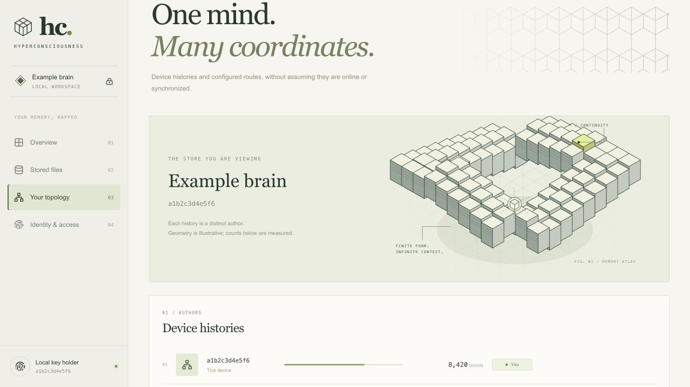
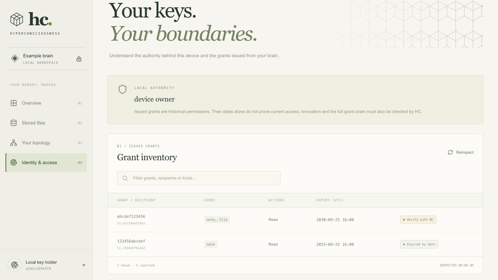
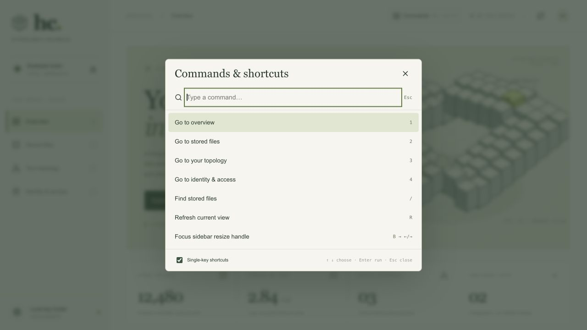

# HC Atlas UI guide

[Back to the dashboard README](../../README.md)

HC Atlas is a local, read-only dashboard for an existing HC brain. Start it using
the [setup instructions](../../README.md#run-locally), then open
<http://127.0.0.1:3217>.

All screenshots below were captured from the real UI on September 25, 2026 using
[synthetic sample metadata](fixtures.json). Names, identities, peers, counts,
and grants are examples, not a snapshot of anyone's personal brain.

## Overview

The overview shows signed records, local disk usage, device histories, and
configured peers. Below the hero, the composition and identity cards describe
the current device; the storage breakdown separates history, blobs, and indexes.



| Measurement | What it means |
| --- | --- |
| Signed records | Locally held history, including knowledge, policy, and audit records. |
| Storage on disk | Allocated bytes in `log`, `blobs`, and `cache`. Projected folders and backups are excluded. |
| Device histories | Distinct authors whose history is held locally. |
| Configured peers | Saved routes. This does not establish that those peers are online or synchronized. |

The geometric illustration is decorative. It does not encode storage health or
replication progress. The footer shows when the overview was inspected.

## Stored files

Select **Stored files** or **Explore your memory** to see the newest stored file
versions. Filter by filename or switch between **All files**, **Local**, and
**Missing chunks**. Local availability describes the referenced chunks held on
this device, not whether a remote copy is durable.



The table currently returns the first 500 files. Its footer states the total
reported by HC and whether the list was truncated. Filters apply to these
returned rows, not to the entire brain. Logical file size differs from allocated
encrypted storage and historical versions.

Click a filename or its arrow to inspect metadata. The dialog shows logical
size, versions, chunk counts, and content ID without opening file contents.
Press **Escape** or the close button to return to the table.



### Loading and refreshing

- The first visit starts one shared background scan. The page shows elapsed time
  and polls for completion every two seconds. You can use other sections meanwhile.
- Completed results stay in server memory. Revisiting the page or reloading the
  browser reuses them. Restarting the dashboard server clears this cache.
- **Reinspect** starts a new scan while keeping the last completed rows visible.
  A failed refresh leaves those rows visible with their original timestamp and
  an error. A failed first scan shows an unavailable state and a retry button.
- A file scan stops after ten minutes. Browser requests stop after twenty seconds.
  An error does not mean the brain has no files.

## Your topology

This view lists device histories held locally and the number of records from
each author. **You** marks the current device; HC-reported frozen histories get
a **Frozen** label. The peer section lists configured routes as **Not probed**.



Opening this view does not connect to peers or trigger replication. It cannot
confirm that another device has received the latest records.

## Identity & access

The authority banner displays HC's own authority description. The grant inventory
shows recipient IDs, kinds, actions, and expiry dates in UTC. Use the filter to
find a grant ID, recipient ID, or kind, and **Reinspect** to read it again.



**Verify with HC** means a future expiry is not proof of active access. HC must
also check revocations and the grant chain. **Expired by date** is only an expiry
observation. Issuing and revoking grants remain HC operations; this UI does not
change permissions.

## Keyboard shortcuts

Press **⌘K** on macOS or **Ctrl+K** to open the searchable command menu.
You can also click **Commands** in the header or press **?** outside a text field.
Type a command, select it with **↑/↓**, then press **Enter**. **Escape** closes the
menu and returns focus to where you were.



| Shortcut | Action |
| --- | --- |
| `1` / `2` / `3` / `4` | Overview / Stored files / Your topology / Identity & access |
| `/` | Focus the current inventory filter; from other sections, open Stored files and focus its filter. |
| `R` | Refresh the current view. An in-progress file scan is reused. |
| `J` / `↓` | Focus the next inventory row. |
| `K` / `↑` | Focus the previous inventory row. |
| `Home` / `End` | Focus the first / last inventory row. |
| `Enter` | Open details for the focused filename. |
| `A` / `L` / `M` | Show all files / local files / files with missing chunks. |
| `B` | Focus the sidebar resize handle; on narrow screens, focus the current navigation button. |
| `Escape` | Close a dialog; in a filter, clear its text, then press again to leave the field. |

In a filter, **↓** moves focus to the first result. **Tab / Shift+Tab** traverse
controls normally. File lists use a single tab stop for the active filename;
arrow keys or J/K move between rows without tabbing through hundreds of files.

Single-key shortcuts do not fire while typing in inputs or editable content,
during text composition, or while a dialog is open. Browser shortcuts such as
**⌘/Ctrl+R** and **⌘/Ctrl+1** keep their normal behavior. Turn off **Single-key
shortcuts** in the command menu if they conflict with assistive technology or
personal preferences. This choice is remembered; **⌘K / Ctrl+K** still works.

## Sidebar resizing

On desktop, drag the sidebar's right edge to resize it between 210 and 360 pixels.
The browser remembers the width. Double-click the edge to reset to 238 pixels.
When the divider has keyboard focus, use **Left/Right** for ten-pixel steps,
**Shift + Left/Right** for fifty-pixel steps, or **Home/End** for the limits.

Narrow screens use compact navigation; the desktop resize handle is hidden.
File dialogs keep keyboard focus inside and restore it to the opener on close.
Animations respect the operating system's reduced-motion preference.

## Refreshing these screenshots

From the dashboard project directory, leave the normal app running on port 3217
and start the isolated documentation preview:

```sh
node scripts/docs-preview.mjs
```

Open <http://127.0.0.1:3228>. This preview uses the app's actual HTML/assets but
intercepts every API request with the checked-in fixtures. It does not query a
real brain. Capture the four views, the `handbook.md` details dialog, and the command menu into
[`screenshots/`](screenshots/), retaining the existing filenames. Stop the
preview with **Ctrl+C** afterward.

Keep example data clearly synthetic. Do not replace these documentation images
with screenshots of personal filenames, device identities, or production grants.
